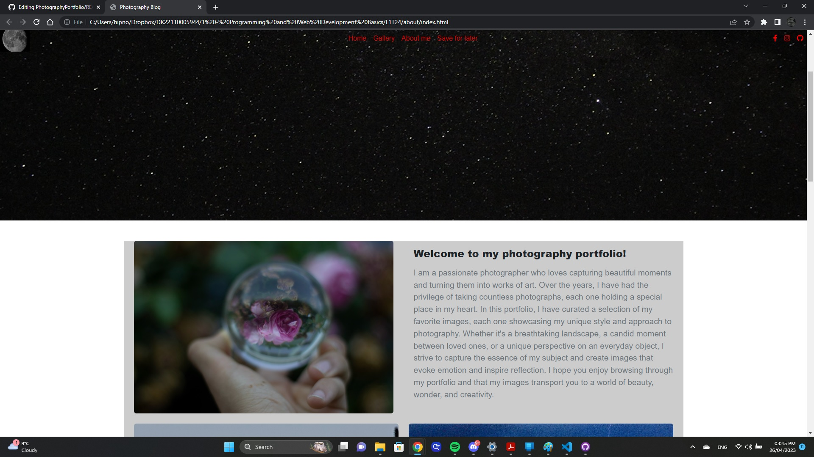
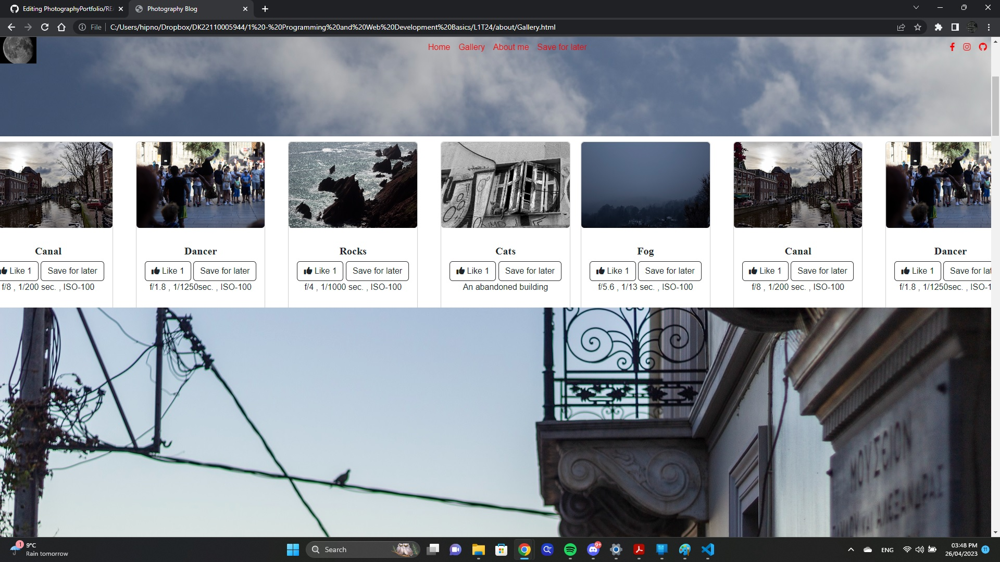
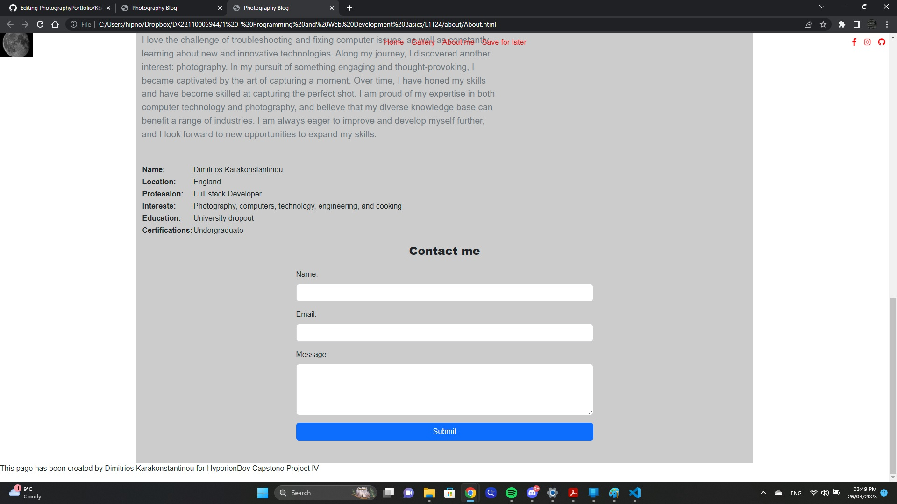

# Photography Portfolio

## Project Name

Photography Portfolio Website

## Description

A Photography Portfolio Website is a responsive, modern, and user-friendly showcase of a photographer's work. This project allows photographers to display their best work, share their bio, and provide a contact form for potential clients to get in touch. The importance of this project is to provide an online presence for photographers, helping them reach a broader audience and grow their business.

## Table of Contents

- [Installation](#installation)
- [Usage](#usage)
- [Screenshots](#screenshots)
- [Credits](#credits)

## Installation

To install the project locally, follow these steps:

1. Clone the repository to your local machine:

   ```
   git clone https://github.com/SpiritDeMojo/PhotographyPortfolio.git
   ```

2. Change to the project directory:

   ```
   cd photography-portfolio
   ```

3. Install the required dependencies:

   ```
   npm install
   ```

4. Start the development server:

   ```
   npm start
   ```

The website should now be running on `http://localhost:3000`.

## Usage

After installing the project, you can use it by following these steps:

1. Navigate to `http://localhost:3000` in your browser.
2. Browse through the portfolio by clicking on the different categories or using the navigation menu.
3. Read about the photographer in the "About" section.
4. Get in touch with the photographer using the contact form provided in the "Contact" section.

## Screenshots


*Homepage with a showcase of the photographer's work.*


*Portfolio section displaying different categories of photography.*


*Contact form for potential clients to get in touch with the photographer.*

## Credits

This project was created by

- Dimitrios Karakonstantinou (https://github.com/SpiritDeMojo)


